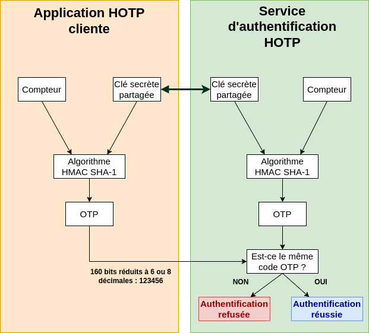
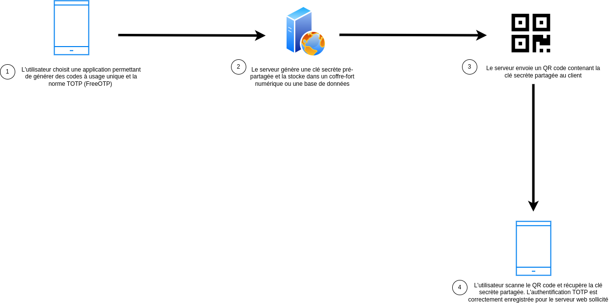
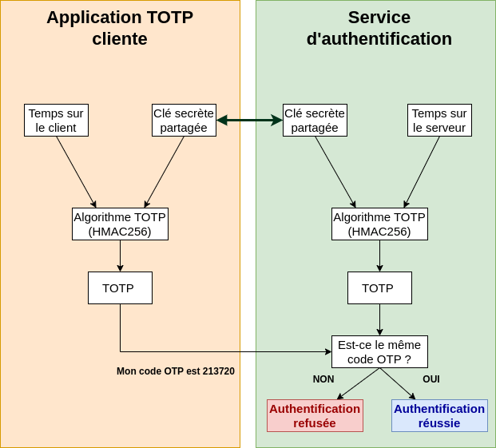
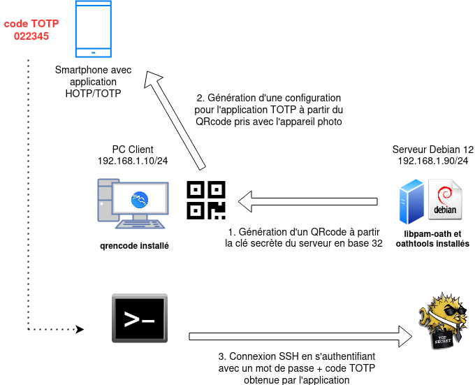

# Authentification TOTP sur Debian

## 1. Rappel sur les mots de passe à usage unique (HOTP/TOTP)

**HOTP**

HOTP (pour HMAC One Time Password) est un mécanisme d’authentification reposant sur l’utilisation d’une clé secrète et d’un compteur commun entre le client et le serveur. HOTP ne nécessite donc pas l’utilisation d’une horloge.
Il se base sur HMAC. HMAC est un type de code d’authentification de message qui combine l’utilisation d’une fonction de hachage (SHA-256) avec une clé secrète dans le but de vérifier simultanément l’intégrité des données et l’authenticité du message.
Toutefois, HOTP est susceptible de perdre la synchronisation du compteur entre le client (par exemple la clé de sécurité) et le serveur. Il peut ainsi s’avérer difficile de maintenir un compteur commun.



**TOTP**

Un mot de passe à usage unique basé sur le temps (TOTP, Time based One Time Password en anglais) est un algorithme permettant de générer un mot de passe à usage unique.
Ainsi, TOTP permet la génération d’une séquence de caractères valable seulement pendant un intervalle de temps limité afin de constituer un mécanisme de double authentification. C’est une extension du mot de passe à usage unique basé sur HMAC. Contrairement à HOTP qui nécessite un compteur incrémental partagé entre les deux entités pour garantir l'utilisation unique, TOTP utilise l'heure (sous réserve que les horloges soient synchronisées) et un secret partagé. Un intervalle de temps de validité est défini pour tolérer une désynchronisation des horloges.[^1]

**Phase d'enregistrement**



**Phase d'authentification**



Dans le schéma ci-dessus, nous constatons que la clé secrète est commune et qu’elle a été transmise au client lors de la phase d’enregistrement. L’avantage de passer par une clé de sécurité est de pouvoir stocker cette clé secrète sur un matériel spécifique et non directement sur le smartphone ou sur l’ordinateur client.

!!! Warning  "Attention"
    Contrairement à la norme FIDO 2, TOTP ne protège pas d’un certain nombre d’attaques (phishing, fuite du secret commun sur le serveur). Cette méthode d’authentification est donc moins robuste que FIDO 2 et ne respecte pas l’état de l’art. Cependant, elle reste une alternative intéressante à l'usage d'un simple mot de passe pour l'accès à des comptes sensibles.

## 2. Schéma de principe concernant la configuration de TOTP sur un système Debian



## 3. Prérequis sur le smartphone et le poste client

Sur votre smartphone, installez l’application FreeOTP+ sur Android ou FreeOTP Authenticator sur IOS (ou toute application OTP compatible). Sur votre poste client Kali ou Ubuntu, installez le paquet qrencode qui permet de générer un QR code afin de paramétrer l’application FreeOTP+ (ou toute application similaire dans un environnement Windows) en lien avec le service oath présent sur le serveur Debian 12.

```bash
sudo apt install qrencode
```

On s’assurera également que la connexion SSH entre le poste client et le serveur Debian est pleinement opérationnelle. Si ce n’est pas le cas, il sera impératif d’installer le service OpenSSH sur le serveur Debian 12 (sudo apt install openssh-server).

```bash
ssh etudiant@192.168.1.90
etudiant@192.168.1.90's password: 
Linux serveur 6.1.0-17-amd64 #1 SMP PREEMPT_DYNAMIC Debian 6.1.69-1 (2023-12-30) x86_64

The programs included with the Debian GNU/Linux system are free software;
the exact distribution terms for each program are described in the
individual files in /usr/share/doc/*/copyright.

Debian GNU/Linux comes with ABSOLUTELY NO WARRANTY, to the extent
permitted by applicable law.
Last login: Wed Jan  3 19:34:10 2024 from 192.168.1.85
etudiant@serveur:~$
```

## 4. Configuration du serveur Debian

Dans un premier temps, il sera nécessaire d’installer les paquets permettant de mettre en œuvre le mécanisme d’OTP nommé OATH[^2] sur le serveur.

```bash
sudo apt install libpam-oath oathtool
```

Puis, nous allons définir un secret sous forme hexadécimal qui sera utilisé par le générateur TOTP/HOTP en lien avec l’utilisateur étudiant et qui sera soumis à la double authentification.

!!! Warning  "Attention"
    Ce secret doit être jalousement gardé car c’est la clé de voûte servant à la génération des mots de passe à usage unique. S’il est compromis, c’est l’ensemble de l’authentification OTP qui sera impacté.

```bash
sudo -i
KEY=$(openssl rand -hex 20)
echo "HOTP/T30/6 etudiant - ${KEY}" >> /etc/security/users.oath
chown root /etc/security/users.oath 
chown 600 /etc/security/users.oath
```

Nous allons maintenant configurer PAM (Pluggable Authentication Modules), le service qui contrôle les authentifications sur le serveur Debian.

```bash
nano /etc/pam.d/sshd
```

```bash
# PAM configuration for the Secure Shell service

# Standard Un*x authentication.
#@include common-auth

auth required pam_unix.so nullok_secure
auth required pam_oath.so usersfile=/etc/security/users.oath window=30 digits=6
```

Nous commentons la ligne @include common-auth car elle empêche l’authentification OTP même en cas de connexion avec le bon mot de passe.

La ligne suivante impose l’authentification par mot de passe stocké en local sur le système et interdit les mots de passe vides.

La dernière impose une fois l’authentification par mot de passe réussie, une deuxième authentification par OTP. Nous faisons référence au fichier contenant le (ou les) nom d’utilisateur concerné ainsi que le secret servant à générer des mots de passe à usage unique. Ce mot de passe disposera de 6 chiffres et aura une durée de validité de 30 secondes.

Il nous reste maintenant à éditer le fichier de configuration du service SSH afin de définir l’usage de l’authentification 2FA.

```bash
nano /etc/ssh/sshd_config
```

```bash
ChallengeResponseAuthentication yes
#KbdInteractiveAuthentication no
UsePAM yes
```

Nous nous assurons de commenter la ligne _KdbInteractiveAuthentication_ et d’avoir les deux autres lignes activées avec la valeur yes. Nous pouvons ensuite redémarrer le service SSH.

```bash
systemctl restart ssh
```

Enfin, il nous reste à récupérer le secret en base 32 qui nous permettra ensuite de générer sur le poste client un QR code pour notre application Android.

```bash
cat /etc/security/users.oath
```

```bash
HOTP/T30/6 etudiant – 65f43c705ce51c9c058ec8bb4b7f64b656681866
root@serveur:~# oathtool -v -d 6 65f43c705ce51c9c058ec8bb4b7f64b656681866
Hex secret: 65f43c705ce51c9c058ec8bb4b7f64b656681866
Base32 secret: MX2DY4C44UOJYBMOZC5UW73EWZLGQGDG
Digits: 6
Window size: 0
Start counter: 0x0 (0)
```
!!! Warning  "Attention"
    Pour que la partie TOTP soit pleinement fonctionnelle, vous devez vous assurer que les horloges des différentes machines sont synchronisées et à l’heure.

## 5. Configuration du poste client et de l'application Android FreeOTP+

Il s’agit maintenant de paramétrer correctement la machine cliente et l’application Android FreeOTP+ afin de rendre opérationnel l’authentification SSH 2FA.

Nous allons d’abord générer sur le poste client (Ubuntu ou Kali) un fichier png contenant un QR code que nous soumettrons à l’application FreeOTP+.

```bash
qrencode -o etudiant.png 'otpauth://totp/etudiant@192.168.1.90?secret=MX2DY4C44UOJYBMOZC5UW73EWZLGQGDG'
```

```bash
ls -l
…
-rw-r--r-- 1 etudiant etudiant        471  3 janv. 23:08  etudiant.png
```

Nous pouvons ouvrir ce fichier PNG sur le poste client puis ouvrir l’application FreeOTP+ sur le smartphone.

Sélectionner l’icône « Appareil photo » en bas à droite. Puis prenez en photo le QR code présent sur l’écran du client. Une nouvelle configuration pour votre utilisateur et votre serveur est automatiquement créée.

Nous pouvons ensuite supprimer le fichier PNG contenant le QR code, car il contient le secret à ne pas compromettre.

Sur le client, nous pouvons lancer une connexion SSH vers le serveur avec le compte etudiant. Après avoir entré votre mot de passe, un OTP vous est demandé. Dans l’application FreeOTP+, sélectionnez la nouvelle configuration. Celle-ci vous fournit un code de 6 chiffres valable 30 secondes.

```bash
ssh etudiant@192.168.1.90               
(etudiant@192.168.1.90) Password: 
(etudiant@192.168.1.90) One-time password (OATH) for `etudiant': 
Linux serveur 6.1.0-17-amd64 #1 SMP PREEMPT_DYNAMIC Debian 6.1.69-1 (2023-12-30) x86_64

The programs included with the Debian GNU/Linux system are free software;
the exact distribution terms for each program are described in the
individual files in /usr/share/doc/*/copyright.

Debian GNU/Linux comes with ABSOLUTELY NO WARRANTY, to the extent
permitted by applicable law.
Last login: Wed Jan  3 22:17:13 2024 from 192.168.1.85
etudiant@serveur:~$
```

[^1]: Source - Wikipédia

[^2]: Initiative pour l’authentification ouverte est une collaboration industrielle visant à développer une architecture de référence ouverte utilisant des normes ouvertes pour promouvoir l’adoption d’une authentification plus robuste que le simple mot de passe