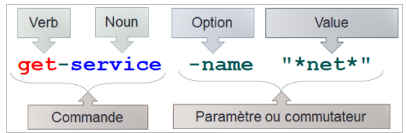

# PowerShell - Introduction

## I. Présentation de PowerShell

**Windows PowerShell** est un interpréteur de commandes conçu pour l’administration des systèmes Windows.  
Il offre à la fois une invite interactive et un environnement de script, pouvant être utilisés séparément ou de manière complémentaire.  

Une de ses particularités est l’introduction des **cmdlets** (ou applets de commande), de petits outils en ligne de commande dédiés à une tâche précise et intégrés à l’interpréteur. Chaque cmdlet peut être utilisée individuellement, mais leur véritable puissance réside dans la possibilité de les enchaîner afin d’automatiser des opérations complexes.  

Par défaut, Windows PowerShell fournit plus d’une centaine de cmdlets de base.  

### Un premier pas…
- Pour exécuter PowerShell en ligne de commande, saisissez :  
  ```powershell
  powershell
````

* Pour vérifier la version de PowerShell (stockée dans une variable) :

  ```powershell
  $PSVersionTable
  ```

---

## II. Les commandes PowerShell ou « cmdlets »

### A. La touche tabulation

La touche `<tab>` permet de compléter automatiquement le nom de la commande, le nom du paramètre, le chemin ou le fichier.
En appuyant plusieurs fois, on parcourt tous les choix disponibles.

### B. Les applets de commandes « cmdlet »

Dans PowerShell, les cmdlets suivent la forme **verbe-nom** pour faciliter la mémorisation.



Exemple :

```powershell
Start-Service -Name eventlog
```

PowerShell **n’est pas sensible à la casse** (majuscule/minuscule) ni aux espaces ou tabulations.

### C. Méthodes et propriétés associées à une cmdlet

PowerShell est basé sur des **objets** et non du texte.

* Les attributs (propriétés) décrivent l’état de l’objet.
* Les méthodes définissent son comportement.

Exemples :

* `Voiture.couleur` → affiche la couleur d’une voiture.
* `Voiture.vitesse()` → affiche la vitesse.

En PowerShell, on peut afficher les propriétés et méthodes d’un objet :

```powershell
Get-Date | Get-Member
```

Cette commande liste les propriétés et méthodes de l’objet retourné par `Get-Date`.

### D. Les alias

PowerShell permet d’utiliser des **alias** pour raccourcir les cmdlets.

* Afficher tous les alias :

  ```powershell
  Get-Alias
  ```

* Exemple :
  `Get-ChildItem` est l’équivalent de `ls`.

* Créer un alias personnalisé :

  ```powershell
  Set-Alias list Get-ChildItem
  ```

⚠️ La durée de vie d’un alias est limitée à la session PowerShell en cours.

### E. Les premières commandes PowerShell

* **Afficher toutes les commandes** :

  ```powershell
  Get-Command
  ```

  Filtrer par verbe ou nom :

  ```powershell
  Get-Command -Verb "<verbe>"
  Get-Command -Noun "<nom>"
  ```

* **Afficher de l’aide** :

  ```powershell
  Get-Help <nom de la commande>
  Get-Help <nom de la commande> -Examples
  <nom de la commande> -?
  ```

  Exemple :

  ```powershell
  Get-Command -?
  ```

* **Effacer le contenu de la console** :

  ```powershell
  Clear-Host
  ```

* **Afficher l’historique des commandes** :

  ```powershell
  Get-History
  ```

* **Lister les processus en cours** :

  ```powershell
  Get-Process
  ```

Toutes les commandes PowerShell sont disponibles sur [Microsoft Docs](https://docs.microsoft.com/fr-fr/powershell/scripting/overview?view=powershell-6).

---

## III. Le pipeline

L’opérateur **pipeline** (`|`) permet de transmettre la sortie d’une commande en entrée d’une autre.

Exemple 1 : mise en forme de la date avec un tableau :

```powershell
Get-Date | Format-Table
```
Résultat :

```
Date                Day   DayOfWeek   DayOfYear        Hour        Kind Millisecond      Minute       
----                ---   ---------   ---------        ----        ---- -----------      ------       
26/10/20...          26      Sunday         300          20       Local         875          54
```

Exemple 2 : filtrer les résultats de `ipconfig` avec `findstr` :

```powershell
ipconfig | findstr "Adresse"
```

Résultat :

```
Adresse IP. . . . . . . . . . . . : 192.168.10.100
Adresse IP. . . . . . . . . . . . : 10.0.0.1
```
