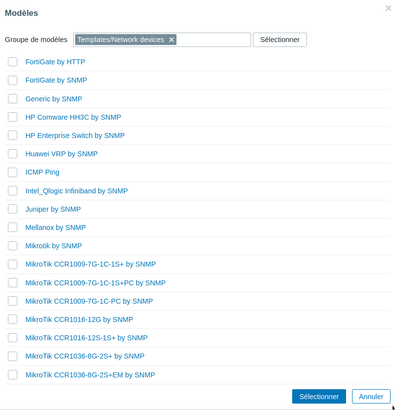
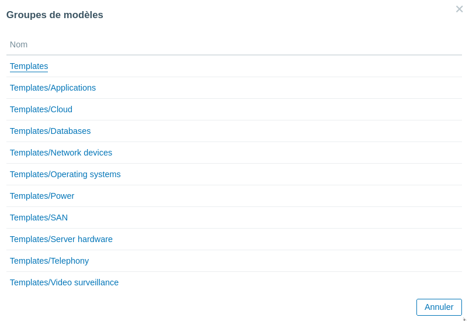
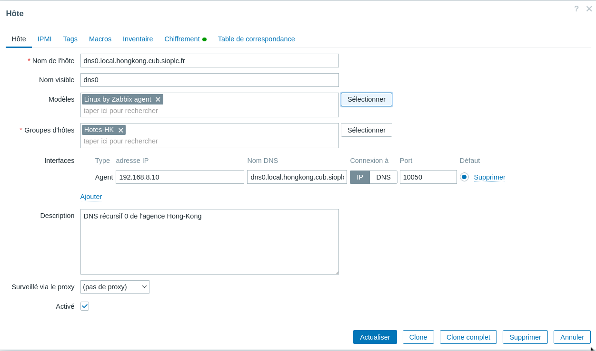

# Utilisation des modèles

Zabbix propose un certain nombre de modèles directement exploitables pour superviser les hôtes présents sur votre réseau. Un modèle dispose en général d’une série d’éléments, déclencheurs, grahiques prêts à l’emploi et transposables à grande échelle. 

Ainsi, il est conseillé de les utiliser en production. Il est tout à fait envisageable de créer son propre modèle au format YAML ou de cloner et personnaliser un modèle existant.

## a) Supervision ICMP écho à l'aide d'un modèle pré-intégré

!!! info "Important"
    **Les macros commencent toujours par les symboles {$ et permettent de fixer une valeur personnalisée qui déclenchera un trigger précis. Lorsque l’on utilise un modèle, des valeurs par défaut sont fixées pour les macros utilisées dans le modèle en question. Mais on voudra la plupart du temps définir nos propres critères.**

Dans l’exemple ci-dessus, nous fixons la valeur de la macro {$ICMP_LOSS_WARN} à 50 (en pourcentage). Ainsi, le trigger ICMP : High ICMP Ping loss s’activera si plus de 50 % de paquets ICMP sont perdus sur une durée de 5 min.

Il est possible de définir les macros au niveau global puis au niveau des modèles et enfin au niveau des hôtes. C’est la macro la plus proche de l’hôte que s’appliquera en priorité, puis celle précisée dans un modèle et enfin celle définie au niveau global.

Vous trouverez davantage d’informations précises sur une macro sur le site officiel de Zabbix.

## b) Supervision à l'aide d'un modèle Linux avec agent Zabbix

