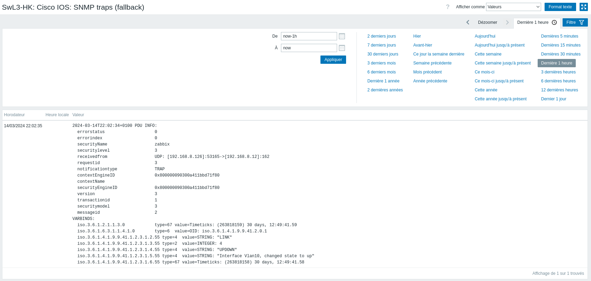

# VII. Mise en place d’une supervision passive à l’aide de traps SNMP[^1]

Il n’est pas toujours pertinent de réaliser une supervision active des équipements à l’aide du protocole SNMP. En effet, pour limiter le nombre de requêtes, pour résoudre des problèmes de sécurité liés à des zones réseaux particulières, il est possible d’activer une remontée d’information depuis l’équipement réseau vers le serveur de supervision lors d’un évènement particulier. 

C’est ce que l’on appelle les traps SNMP.

## a) Configuration du serveur Zabbix

```bash
etudiant@zabbix:~# sudo apt update && sudo apt upgrade
etudiant@zabbix:~# sudo apt install snmptrapd libsnmp-perl curl
etudiant@zabbix:~# sudo -i
root@zabbix:~# curl -O https://git.zabbix.com/projects/ZBX/repos/zabbix/raw/misc/snmptrap/zabbix_trap_receiver.pl
root@zabbix:~# mv zabbix_trap_receiver.pl /etc/zabbix/

root@zabbix:~# nano /etc/zabbix/zabbix_trap_receiver.pl
$SNMPTrapperFile = '/var/log/snmptrap/snmptrap.log';

root@zabbix:~# mdkir /var/log/snmptrap
root@zabbix:~# touch /var/log/snmptrap/snmtrap.log
root@zabbix:~# chown -R zabbix:zabbix /var/log/snmptrap/
```

Nous récuperons à l’aide de SNMP l’engine ID de l’équipement afin de l’ajouter dans le fichier de configuration /etc/snmp/snmptrapd.conf.

```bash
SwL3-HKCUB# show snmp engineID
Local SNMP engineID: 800000090300A411BBD71F80
Remote Engine ID          IP-addr    Port

root@zabbix:~# nano /etc/snmp/snmptrapd.conf

# Il faut créer une authentification 
createUser -e "0x800000090300A411BBD71F80" zabbix SHA etudiant_007 AES azerty2QWERTY

authUser execute zabbix
perl do "/etc/zabbix/zabbix_trap_receiver.pl"

root@zabbix:~# nano /etc/zabbix/zabbix_server.conf

SNMPTrapperFile=/var/log/snmptrap/snmptrap.log
StartSNMPTrapper=1

root@zabbix:~# systemctl restart snmptrapd zabbix-server
root@zabbix:~# systemctl enable snmptrapd
```


## b) Configuration d’un équipement réseau Cisco

```bash
SwL3-HKCUB(config)# snmp-server enable traps
SwL3-HKCUB(config)# snmp-server host 192.168.8.12 version 3 priv zabbix
```

## c) Vérification de la remontée de la trap sur le serveur Zabbix

```bash
root@zabbix:~# cat /var/log/snmptrap/snmptrap.log
2024-03-14T22:02:34+0100 ZBXTRAP 192.168.8.126
PDU INFO:
  errorstatus                    0
  errorindex                     0
  securityName                   zabbix
  securitylevel                  3
  receivedfrom                   UDP: [192.168.8.126]:53165->[192.168.8.12]:162
  requestid                      3
  notificationtype               TRAP
  contextEngineID                0x800000090300a411bbd71f80
  contextName                    
  securityEngineID               0x800000090300a411bbd71f80
  version                        3
  transactionid                  1
  securitymodel                  3
  messageid                      2
VARBINDS:
  iso.3.6.1.2.1.1.3.0            type=67 value=Timeticks: (263818159) 30 days, 12:49:41.59
  iso.3.6.1.6.3.1.1.4.1.0        type=6  value=OID: iso.3.6.1.4.1.9.9.41.2.0.1
  iso.3.6.1.4.1.9.9.41.1.2.3.1.2.55 type=4  value=STRING: "LINK"
  iso.3.6.1.4.1.9.9.41.1.2.3.1.3.55 type=2  value=INTEGER: 4
  iso.3.6.1.4.1.9.9.41.1.2.3.1.4.55 type=4  value=STRING: "UPDOWN"
  iso.3.6.1.4.1.9.9.41.1.2.3.1.5.55 type=4  value=STRING: "Interface Vlan10, changed state to up"
  iso.3.6.1.4.1.9.9.41.1.2.3.1.6.55 type=67 value=Timeticks: (263818158) 30 days, 12:49:41.58
```



[^1]: Cette documentation est directement inspirée de la production des collègues du BTS SIO du lycée Laetitia Bonaparte d'Ajaccio
