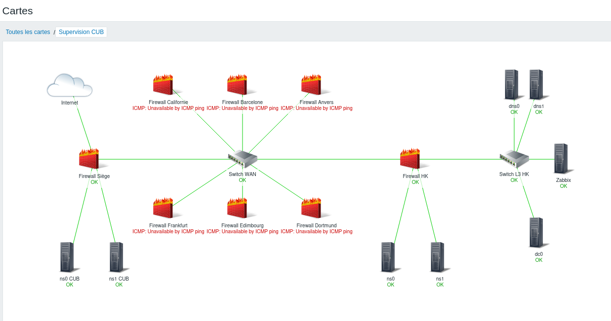

# VIII. Cartographie

Sur Zabbix, vous avez la possibilité de créer une carte permettant d’avoir une représentation graphique de votre réseau avec les remontées d’alerte présente dessus. Pour créer une carte, il suffit de se rendre dans le menu *Surveillance > Cartes*.

