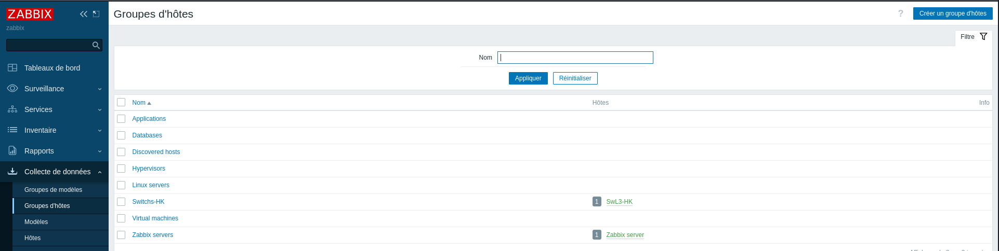
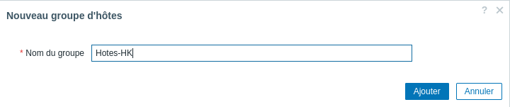
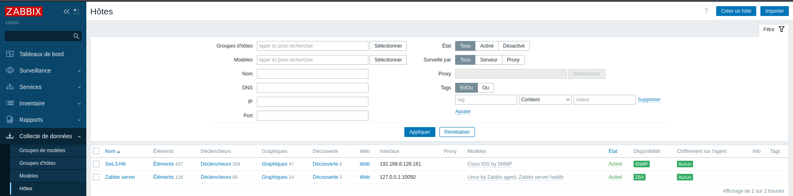
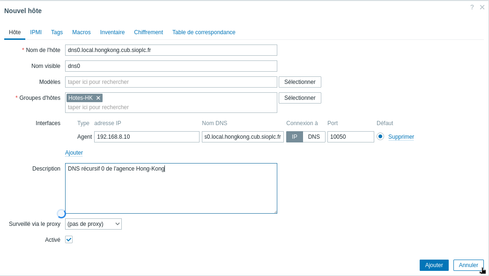
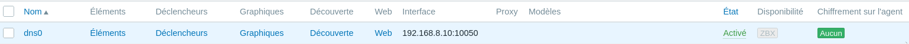
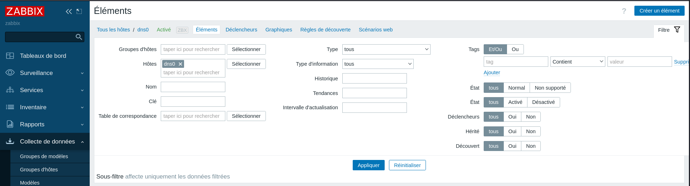
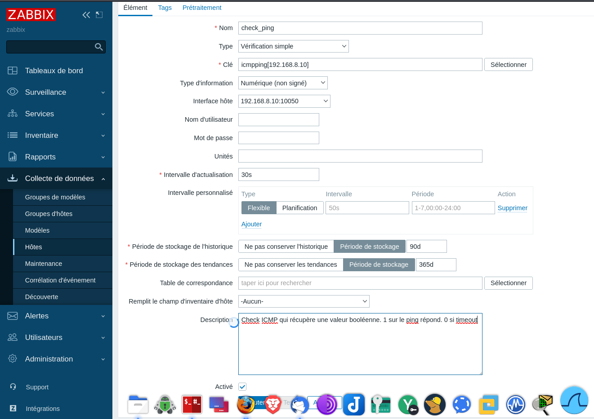
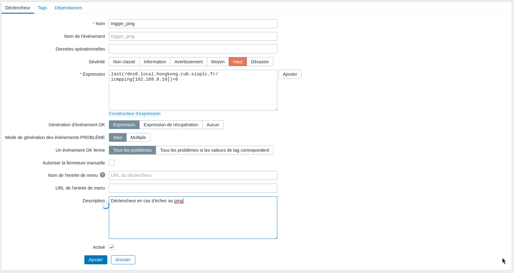

# 2. Supervision simple d’un hôte à l’aide du protocole ICMP écho

La vérification la plus simple que l’on peut faire pour superviser un hôte sur le réseau est l’envoi d’un paquet ICMP écho. Si l’hôte nous répond alors la valeur retournée est 1 sinon la valeur retournée est 0. Si l’on obtient 0, il faudra alors déclencher une alerte afin de prévenir que l’hôte en question est injoignable depuis l’outil de supervision.

Les étapes nécessaires à la mise en place de cette supervision sont les suivantes :

1. Création d’un groupe d’hôte
2. Création d’un hôte
3. Création d’un élément (en l’occurrence une vérification ICMP écho) avec récupération d’une donnée (ici en booléen 1 ou 1).
4. Création d’un déclencheur (permettant d’activer une alerte en cas de récupération de la valeur 0).

La création de ces différents objets se fait via le menu **Collecte de données** situé à gauche.

## Étape 1 - Création d'un nouveau groupe d'hôtes

## Étape 2 – Créer un nouvel hôte à superviser

!!! Warning  "Attention"
    Même dans le cas d’une supervision simple sans agent Zabbix, ni agent SNMP, il est obligatoire d’indiquer une interface au nouvel hôte. On choisira par défaut une interface « Agent ».

## Étape 3 - Créer un nouvel élément

Ici nous allons créer un élément permettant de récupérer une valeur booléenne (1 réponse au ping, 0 absence de réponse) en fonction de la réponse à la requête ICMP écho envoyée par le serveur de supervision.

## Étape 4 - Créer un déclencheur permettant d'établir une action

Nous récupérons dorénavant une valeur booléenne dans notre console de supervision. Mais que se passe-t-il en cas d’échec du ping (retour de la valeur 0) ? Pour l’instant rien. Le trigger va nous permettre de définir une action en cas de récupération d’une valeur 0.

Une fois, les différentes étapes réalisées pour mettre en place la supervision ICMP, vous pouvez vérifier les données collectées pour votre hôte via le menu Surveillance > Dernières données. Filtrez les informations pour votre nouvel hôte en particulier.

Si votre serveur de supervision n’obtient pas de réponse au ping de la part de l’hôte supervisé, une alerte apparaîtra au niveau de votre Dashboard.

