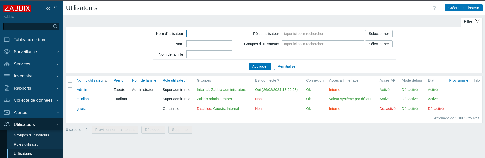
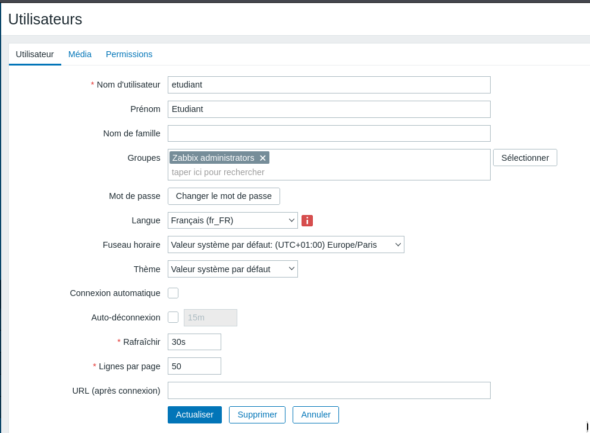
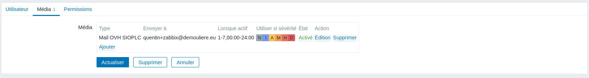
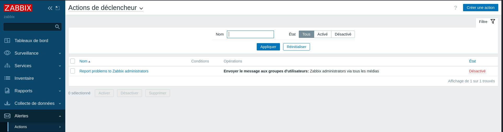
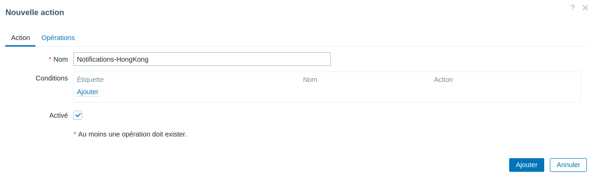
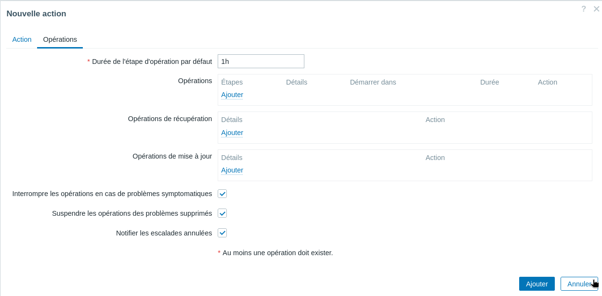
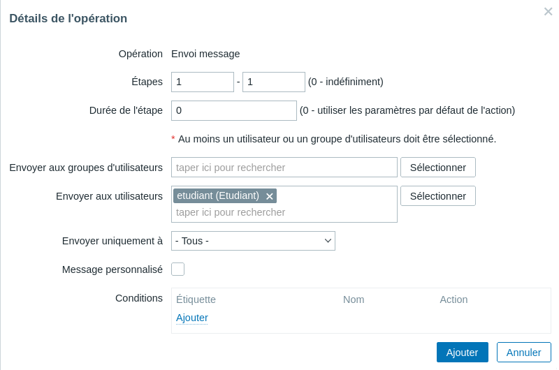

# III. Mise en place des notifications

Dorénavant grâce à la mise en place de déclencheurs (triggers), vous êtes en mesure d’obtenir des alertes sur votre Dashboard d’interface d’administration. Or, vous n’êtes pas toujours connecté dessus et vous souhaitez cependant être alerté dès que possible de problèmes à résoudre. C’est là que les notifications interviennent.

Les notifications sont très importantes parce qu’elles permettent aux Administrateurs d’être alertés en quasi-temps réel de l’émergence d’un incident. Sur Zabbix, un grand nombre de médias peut être utilisé (E-mail, Discord, Microsoft Teams, Telegram…). Vous pouvez voir la liste de ces derniers dans votre console d’administration.

## Etape 1 - Choix du média utilisé pour l'envoi de notifications

Par simplicité et parce que le mail reste un média professionnel privilégié, nous configurerons les notifications par e-mail et le protocole SMTP via le menu Alertes > Types de média.

Comme il existe de moins en moins de serveur SMTP ouvert pour l’envoi de message, je vous propose d’utiliser celui de l'un de nos prestataires avec l’utilisation d’un compte créé pour l’occasion.

Pour éviter de retrouver votre mail dans les SPAMS, il est conseillé de conserver les paramètres SMTP helo et adresse SMTP utilisés dans la capture d’écran ci-dessus. Les paramètres à renseigner sont les suivants :

* Nom : Mail OVH SIOPLC
* Type : Courriel
* Fournisseur de messagerie : Generic SMTP
* serveur SMTP : Fourni par l'enseignant
* Port du serveur SMTP : 465
* Courriel : Fourni par l'enseignant
* SMTP helo : Fourni par l'enseignant
* Sécurisation de la connexion : SSL/TLS
* Authentification : Nom d'utilisateur et mot de passe-t-il
* Nom d'utilisateur : Fourni par l'enseignant
* Mot de passe : Fourni par l'enseignant
* Format du message : Texte brut
* Description : Accès SMTP Zabbix Agence

## Etape 2 - Définition d'une adresse mail et d'un media pour l'utilisateur

Les notifications seront envoyées à un utilisateur ou un groupe d’utilisateur. Ainsi, il est indispensable dans le cas d’un mail, de définir une adresse mail pour l’utilisateur concerné ainsi que le média utilisé et les types de notification envoyés.

## Etape 3 - Configurer l'envoi de mail en cas d'activation d'un déclencheur

Il reste maintenant à spécifier au serveur Zabbix, que nous souhaitons envoyer une notification par mail en cas d’activation d’un déclencheur vis-à-vis d’un hôte supervisé via le menu Alertes > Actions > Actions de déclencheur.

Pour vérifier que l’envoi de notifications est pleinement opérationnel en cas d’activation d’un déclencheur, il suffit de mettre en place un test permettant de générer une alerte.

