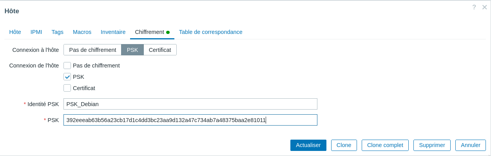
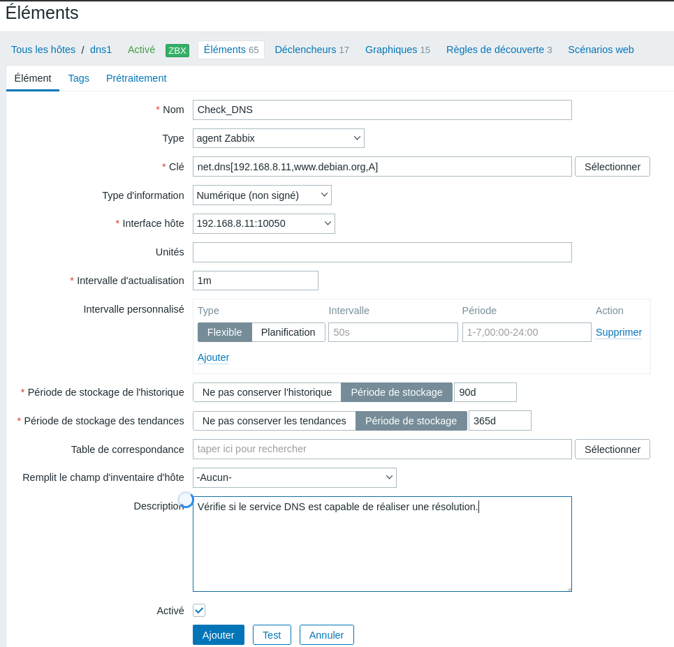

# IV. Supervision des hôtes à l'aide de l'agent Zabbix

## Étape 1 - Préparation du système et installation de l’agent Zabbix sous Debian GNU/Linux 12

```bash 
etudiant@dns0:~$ cat /etc/debian_version 
12.13

etudiant@dns0:~$ sudo apt update && sudo apt upgrade

etudiant@dns0:~$ wget https://repo.zabbix.com/zabbix/7.0/debian/pool/main/z/zabbix-release/zabbix-release_latest_7.0%2Bdebian12_all.deb

etudiant@dns0:~$ sudo dpkg -i zabbix-release_latest_7.0+debian12_all.deb

etudiant@dns0:~$ sudo apt install zabbix-agent
```

## Étape 2 - Mise en place d’un chiffrement entre l’agent Zabbix et le serveur de supervision à l’aide d’une clé partagée PSK

```bash
etudiant@dns0:~$ openssl rand -hex 32

etudiant@dns0:~$ echo 392eeeab63b56a23cb17d1c4dd3bc23aa9d132a47c734ab7a48375baa2e81011 > zabbix_agentd.psk

etudiant@dns0:~$ sudo mv zabbix_agentd.psk /etc/zabbix/
etudiant@dns0:~$ sudo chown zabbix:zabbix /etc/zabbix/zabbix_agentd.psk
```

## Étape 3 – Configuration de l’agent Zabbix sur l’hôte à superviser

```bash
etudiant@dns0:~$ sudoedit /etc/zabbix/zabbix_agentd.conf

##### Passive checks related
Server=192.168.8.12
### Option: ListenPort
ListenPort=10050
### Option: ListenIP
ListenIP=192.168.8.10

####### TLS-RELATED PARAMETERS #######
### Option: TLSConnect
TLSConnect=psk
TLSAccept=psk
TLSPSKFile=/etc/zabbix/zabbix_agentd.psk
TLSPSKIdentity=PSK_Debian

etudiant@dns0:~$ sudo systemctl restart zabbix-agent.service 
etudiant@dns0:~$ sudo systemctl status zabbix-agent.service 
```

Il est possible de tester la connectivité entre le serveur Zabbix et l’agent à l’aide de la commande suivante :

```bash
etudiant@zabbix:~$ sudo apt install zabbix-get
etudiant@zabbix:~$ echo 392eeeab63b56a23cb17d1c4dd3bc23aa9d132a47c734ab7a48375baa2e81011 > zabbix_agent.psk
etudiant@zabbix:~$ zabbix_get -s 192.168.8.10 -k system.hostname --tls-connect=psk --tls-psk-identity="PSK_Debian" --tls-psk-file=/home/etudiant/zabbix_agent.psk
```

## Étape 4 - Création de l’hôte dans le serveur de supervision




Comme nous avons choisi de chiffrer les communications entre l’agent et le serveur, il est indispensable de paramétrer ce chiffrement au moment de la création de l’hôte. Nous choisirons dans le cas présent un chiffrement PSK, puis définirons correctement l’identité de la clé ainsi que son contenu (à l’identique du fichier PSK créé sur l’hôte monitoré).

## Étape 5 - Supervision d'un service réseau avec l'agent Zabbix




Pour superviser un service réseau après avoir ajouté au préalable un hôte monitoré via l’agent Zabbix. Il est nécessaire de créer un nouvel élément de type « Agent Zabbix » puis de sélectionner une clé correspondant à notre besoin. Une fois, l’élément correctement défini et une valeur récupérée, nous devons créer un déclencheur afin de générer une alerte en cas d’interruption du service réseau en question.

