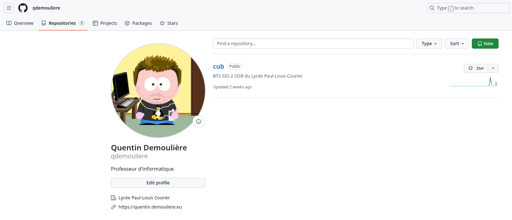
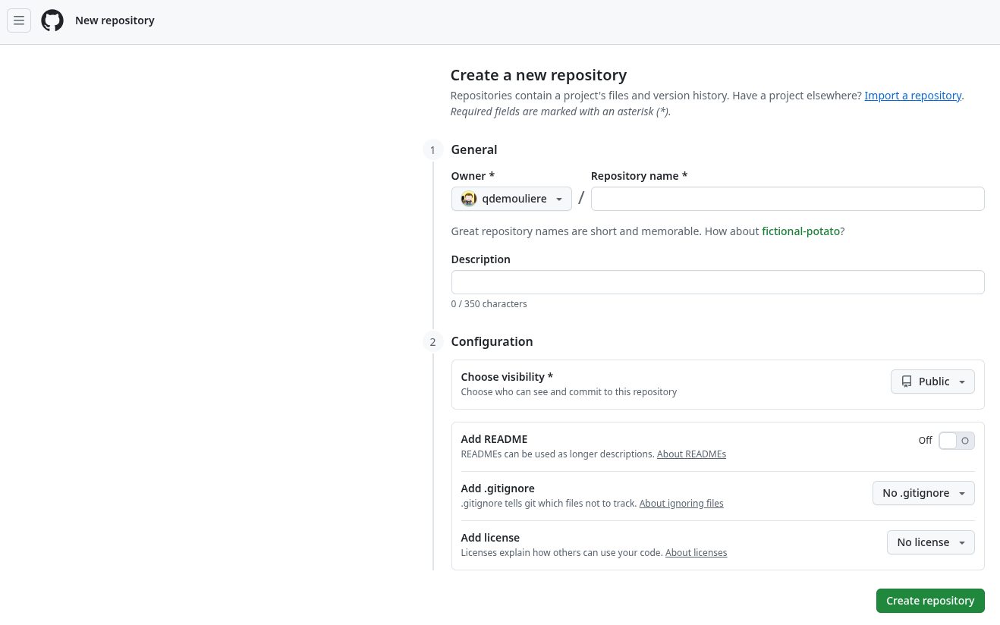
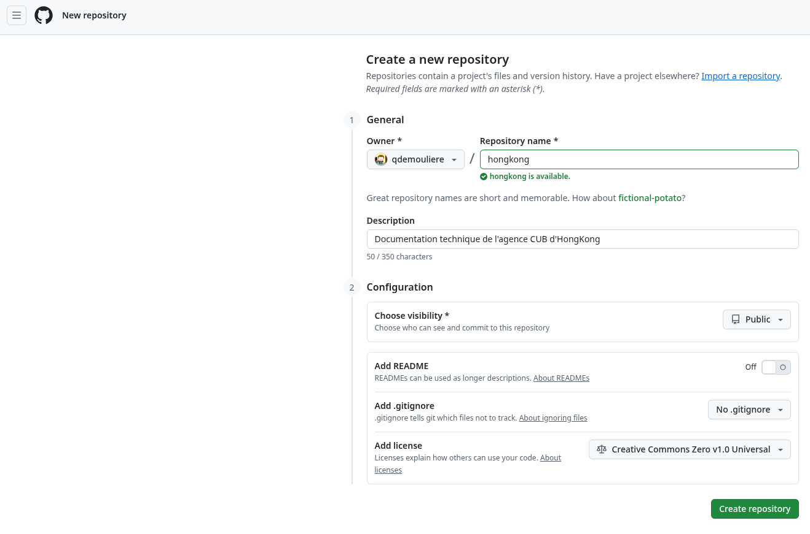
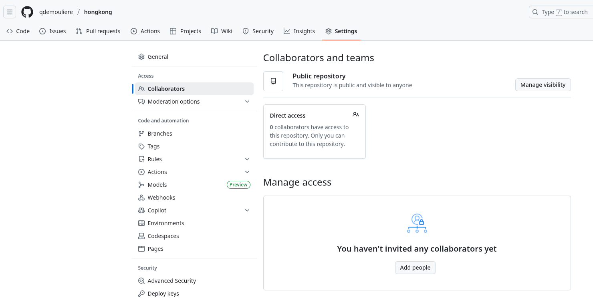
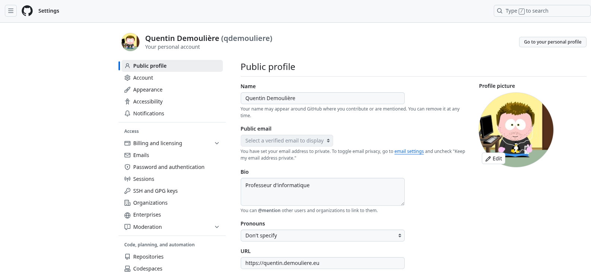
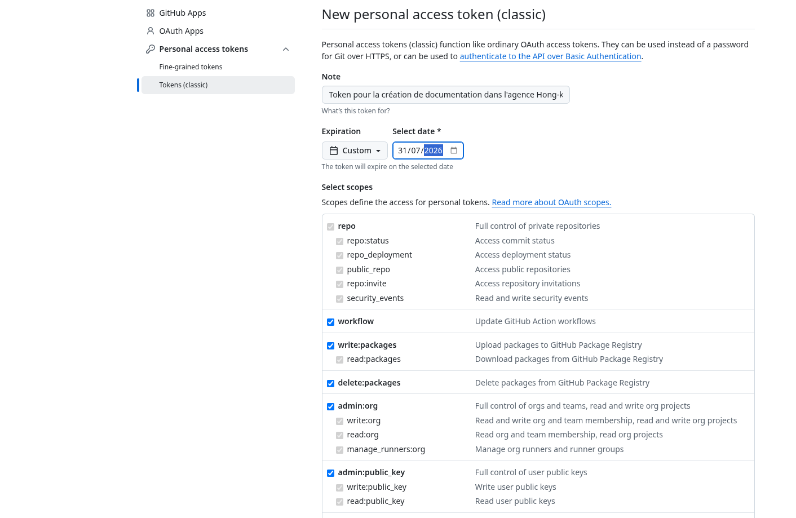
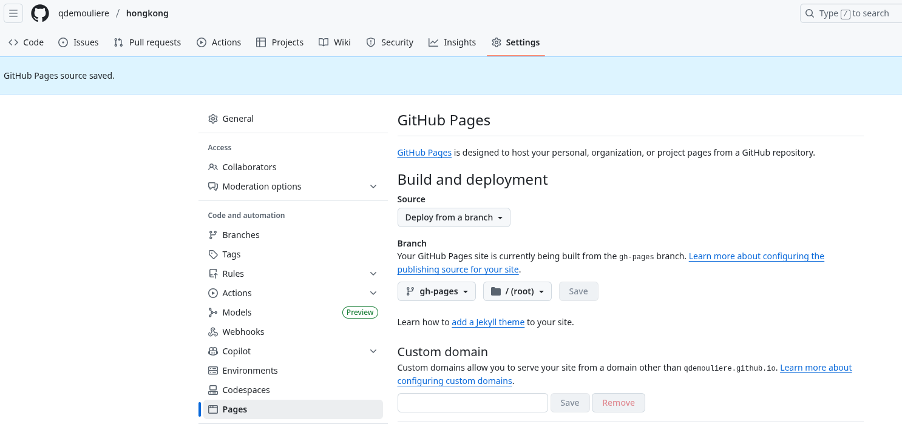
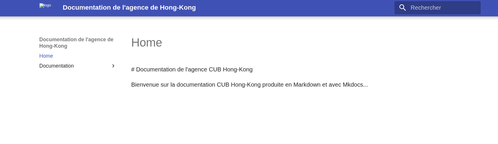

# Mise en place d'une documentation à l'aide de Markdown, Git, Mkdocs et GitHub

## 1. Qu'est-ce que Markdown ?

Markdown est un langage de balisage léger créé en 2004 par John Gruber, avec l'aide d'Aaron Swartz [^1] avec l'objectif d'offrir une syntaxe, facile à lire et à écrire, en l'état, sans formatage. Markdown est principalement utilisé dans des blogs, des sites de messagerie instantanée, des forums et des pages de documentation de logiciels. Depuis quelques années, Markdown est utilisé par la communauté scientifique, en lien avec la Science ouverte.

Un document balisé par Markdown peut être converti en HTML, en PDF ou en d'autres formats. [^2]

## 2. La syntaxe Markdown

Le net regorge de ressources pour apprendre le fonctionnement de la syntaxe Markdown. Cette syntaxe se veut relativement simple et facile d'accès. Voici une liste non-exhaustive d'URL à votre disposition :

* [https://www.markdownguide.org/basic-syntax/](https://www.markdownguide.org/basic-syntax/)
* [https://www.it-connect.fr/apprendre-a-ecrire-en-markdown/](https://www.it-connect.fr/apprendre-a-ecrire-en-markdown/)
* [https://docs.framasoft.org/fr/grav/markdown.html](https://docs.framasoft.org/fr/grav/markdown.html)

## 3. Création d'un nouveau dépôt distant sur GitHub

Une fois votre compte GitHub créé, vous pouvez créer un nouveau répertoire pour votre projet (New).







Une fois le répertoire créé, vous pouvez y ajouter vos collaborateurs, en l'occurrence, ceux qui participeront à la documentation avec vous. Pour cela, il faut se rendre dans **Settings** puis dans **Collaborators**.



## 4. Récupération du dépôt créé sur GitHub comme dépôt local

### 4.1 Gestion du dépôt local

Maintenant que votre dépôt est présent sur GitHub, vous allez pouvoir le télécharger sur votre machine en tant que dépôt local

```bash
cd /home/etudiant/documentations/
git clone https://github.com/qdemouliere/hongkong.git
```
!!! Warning  "Attention"
    Dans l'exemple ci-dessus, le dossier _/home/etudiant/documentations/_ existe déjà. Les commandes systèmes se font également sur un système GNU/Linux. Dans le cas où vous êtes dans un environnement Windows, il sera nécessaire vous adapter. Les commandes **git** restent identiques peu importe l'OS.

```bash
ls -l 
```

```
...
drwxr-xr-x 3 etudiant etudiant  4096 21 sept. 18:18 hongkong
```

Une fois le répertoire distant cloné, vous pouvez commencer à travailler. Pour pouvoir héberger votre documentation en Markdowk sur les Github Pages avec Mkdocs, vous devrez créer l'arborescence suivante à partir de la racine (ici le répertoire: _/home/etudiant/documentations/hongkong_).

```
/home/etudiant/documentations/hongkong
                                |_______docs
                                |_______mkdocs.yaml
                                |_______README.md
```

Le répertoire **docs** contiendra l'ensemble de votre documentation de votre agence. Le fichier **mkdocs.yaml** est le fichier de configuration de l'outil mkdocs, il permet de définir les paramètres de votre site et les plugins utilisés. Nous vous suggérons de vous inspirer de celui présent dans [la documentation générale CUB](https://github.com/qdemouliere/cub). Enfin le README.md permet de fournir des informations aux utilisateurs consultant le dépôt en question.

```
/home/etudiant/documentations/hongkong/docs
                                        |_____documentation
                                        |_____media
                                        |_____index.md
```

Dans le répertoire _/home/etudiant/documentations/hongkong/docs_, c'est davantage à vous de gérer la structure comme bon vous semble. Le fichier **index.md** correspond à la page principale de votre documentation. Les répertoires que vous créerez et hébergeant des fichiers **.md** serviront de menus dans la barre latérale. Enfin, nous vous suggérons la création d'un répertoire **média** contenant l'ensemble des images (JPEG, PNG) mobilisées dans vos différentes documentations. Mais libre à vous de choisir la structure la plus adaptée à votre situation.

??? info "À propos des répertoires"
    Tant que les répertoires créés sont vides, ils ne seront pas présents dans votre dépôt distant.

En termes de commandes cela donne donc la chose suivante :

```bash
 cd /home/etudiant/documentations/hongkong
 mkdir -p docs/documentation docs/media
 vim docs/index.md
```
La dernière commande _vim_ est un éditeur de texte en ligne de commande qui vous permet de créer le fichier _index.md_ contenant votre page de présentation au format markdown. Voici un exemple simple et basique :

```
 # Documentation de l'agence CUB Hong-Kong

 Bienvenue sur la documentation CUB Hong-Kong produite en Markdown et avec Mkdocs...
```
Une fois ces changements opérés sur votre dépôt local, il est indispensable dans informer votre gestionnaire de version Git et de réaliser un premier commit (cf documentation sur Git).

```bash
 git add --all
```

```bash
 git commit -m "Création de la structure du site de documentation et de la page de présentation 210925"
```
!!! Warning  "Attention"
    Le libellé du commit doit être le plus explicite possible car il doit permettre à n'importe quel collaborateur de pouvoir consulter l'historique et de comprendre à quoi a servi le commit en question.

Vous pouvez vérifier que votre dépôt distant est correctement déclaré dans votre GIT local.

```bash
 git remote -v
```

```
origin	https://github.com/qdemouliere/hongkong.git (fetch)
origin	https://github.com/qdemouliere/hongkong.git (push)
```
### 4.2 Gestion et synchronisation avec le dépôt distant sur GitHub

À partir de là, il est possible de synchroniser votre dépôt local avec votre dépôt distant afin que les modifications appliquées sur votre ordinateur le soient maintenant sur Github. Pour cela, il faut indiquer à Git quel est votre dépot distant et si vous souhaitez utiliser HTTPS ou SSH.

!!! Warning  "Attention"
    Depuis plusieurs années, pour des raisons évidentes de sécurité, Github a interdit l'authentification par login/mot de passe. Il est nécessaire de passer par la création d'un jeton spécifique.

Pour vous créer un jeton personnel d'accès, cliquez sue votre photo de profil puis sur _Settings_. Puis cliquez dans le menu à gauche tout en bas sur _Developer Settings_. Cliquez toujours dans le menu à gauche sur  _Personal access tokens_ puis sur _Tokens (classic)_ > _Generate a new token_ > _Generate a new token (classic)_.






Le site vous demande ensuite de vous authentifier à l'aide de votre mot de passe. Puis il est nécessaire de définir les paramètres du token dont la date d'expiration. Prévoyez une date suffisamment longue au regard de votre formation (ex: 01/08/2026). Vous pouvez vous octroyer l'ensemble des authorisations. Il faut conserver précieusement ce token **dans un gestionnaire de mots de passe par exemple** puisque c'est lui qui vous sera demandé lorsque vous lancerez des commandes telles que _git push_.

```bash
git push -u origin main
```

!!! Warning  "Attention"
    Lorsque le mot de passe vous est demandé, saisissez le token fourni par GitHub et non le mot de passe associé à votre compte.

```
Username for 'https://github.com': qdemouliere
Password for 'https://qdemouliere@github.com': 
Énumération des objets: 5, fait.
Décompte des objets: 100% (5/5), fait.
Compression par delta en utilisant jusqu'à 8 fils d'exécution
Compression des objets: 100% (3/3), fait.
Écriture des objets: 100% (4/4), 470 octets | 235.00 Kio/s, fait.
Total 4 (delta 0), réutilisés 0 (delta 0), réutilisés du paquet 0 (depuis 0)
To https://github.com/qdemouliere/hongkong.git
   912197f..ff915e2  main -> main
la branche 'main' est paramétrée pour suivre 'origin/main'.
```

## 5. Activation de Mkdocs et des GitHub Pages

Votre dépôt GitHub est dorénavant identique à votre dépôt local. Toutefois la génération automatique des pages HTML à partir du contenu de vos fichiers Markdown avec Mkdocs doit être activée sur GitHub.

### 5.1 Création d'une action GitHub

À la racine de votre dépôt, créez une nouvelle action GitHub nommée _.github/workflows/ci.yml_ disposant des lignes suivantes :

```bash
 cd /home/etudiant/documentations/hongkong
 mkdir -p .github/workflows/
 vim .github/workflows/ci.yml
```

```
name: ci 
on:
  push:
    branches:
      - master 
      - main
permissions:
  contents: write
jobs:
  deploy:
    runs-on: ubuntu-latest
    steps:
      - uses: actions/checkout@v4
      - name: Configure Git Credentials
        run: |
          git config user.name github-actions[bot]
          git config user.email 41898282+github-actions[bot]@users.noreply.github.com
      - uses: actions/setup-python@v5
        with:
          python-version: 3.x
      - run: echo "cache_id=$(date --utc '+%V')" >> $GITHUB_ENV 
      - uses: actions/cache@v4
        with:
          key: mkdocs-material-${{ env.cache_id }}
          path: ~/.cache 
          restore-keys: |
            mkdocs-material-
      - run: pip install mkdocs-material 
      - run: mkdocs gh-deploy --force
```
Prévenez Git des modifications effectuées et réalisez un commit avant de refaire un push vers votre dépôt GitHub.

```bash
 cd /home/etudiant/documentations/hongkong
 git add --all
 git commit -m "Ajout de la CI pour mkdocs 210925"
```

```bash
    git push -u origin main
```

### 5.2 Vérification de la configuration des GitHub Pages sur GitHub

Depuis la page de votre répertoire, cliquez sur _Settings_ puis _Pages_ dans le menu à gauche. Vérifiez que sous _Branch_, _gh_pages_ soit sélectionné. Sauvegardez les modifications si ce n'est pas le cas.



## 6. Accès à vos GitHub Pages

Grâce à Mkdocs, vous pouvez ainsi accéder à votre site statique généré automatiquement via l'URL : https://user.github.io/projet (ex: https://qdemouliere.github.io/hongkong).



Si vous possédez un nom de domaine et souhaitez disposer d'une URL customisée, GitHub vous propose cette possibilité.

## 7. Travail collaboratif et documentation

Plusieurs stratégies pour travailler en commun sur cette documentation sont envisageables. Les bonnes pratiques recommandent en général que chaque membre travaille sur une branche distincte de la branche principale puis que ces dernières soient fusionnées le moment venu (merge).

Par simplicité, il est possible de travailler ensemble sur la branche principale **main**. Mais cela nécessite d'être rigoureux !

!!! Warning  "Attention"
    **Dès que vous voulez apporter des modifications à votre dépôt local, veillez systématiquement à obtenir la dernière version de votre dépôt distant surtout si l'un de vos collaborateurs l'a mis à jour entre temps. Si vous ne le faîtes pas, vous vous exposez à des problèmes liés à des différences de versions utilisées entre votre dépôt local et le dépôt distant.**

```bash
 cd /home/etudiant/documentations/hongkong
 git pull
```

[^1]: Aaron Swartz (1986-2013) était un informaticien, hacker, hacktiviste, défenseur de la culture comme bien commun de l'humanité. Il est l'un des fondateurs du site Reddit et à l'origine d'avancées majeures comme Markdown, les flux RSS, ou la licence Creative Commons. Si vous voulez en savoir plus sur sa vie, regardez le documentaire "The internet's own boy".

[^2]: Source : Wikipédia (https://fr.wikipedia.org/wiki/Markdown)